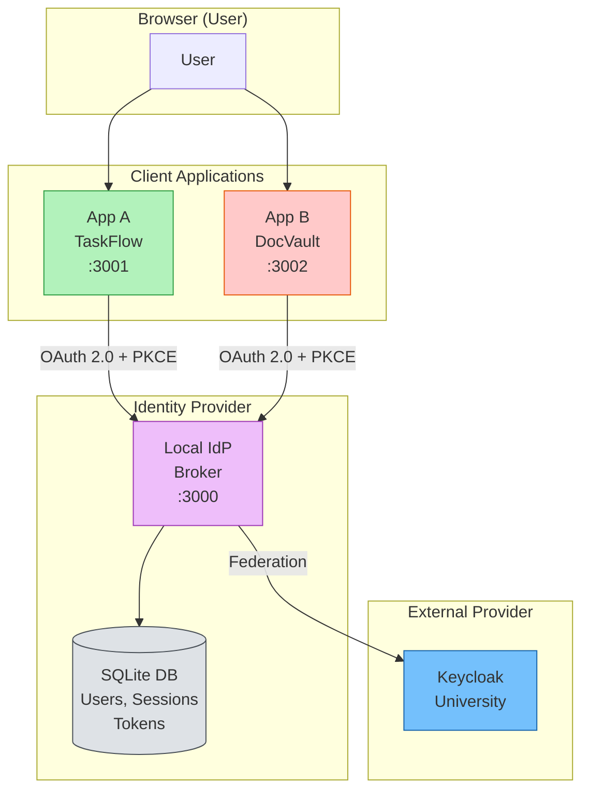
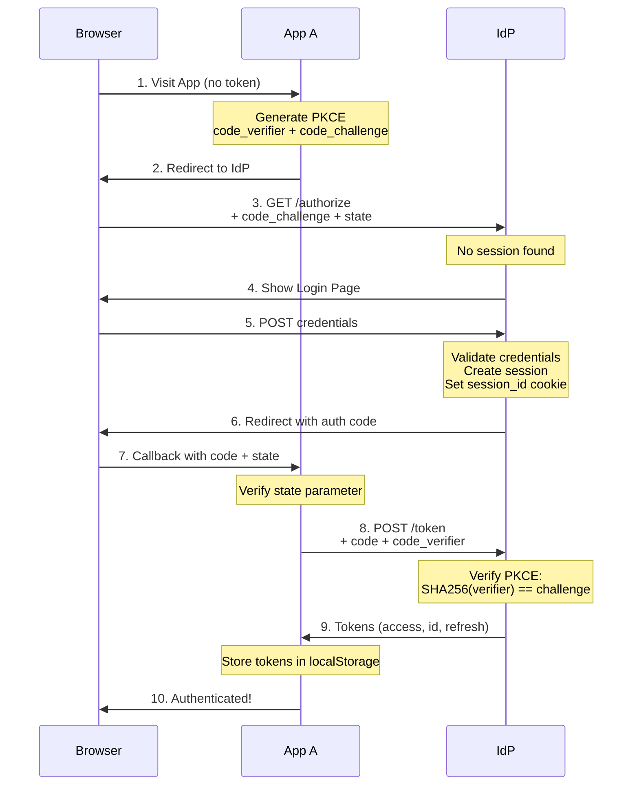
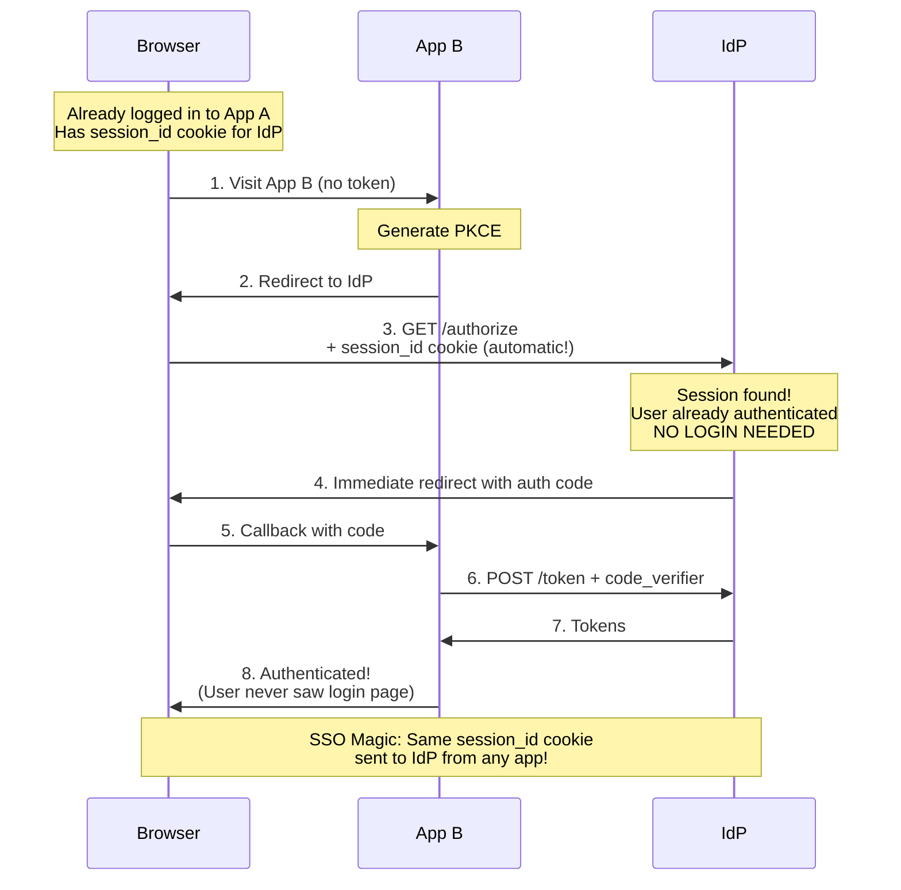
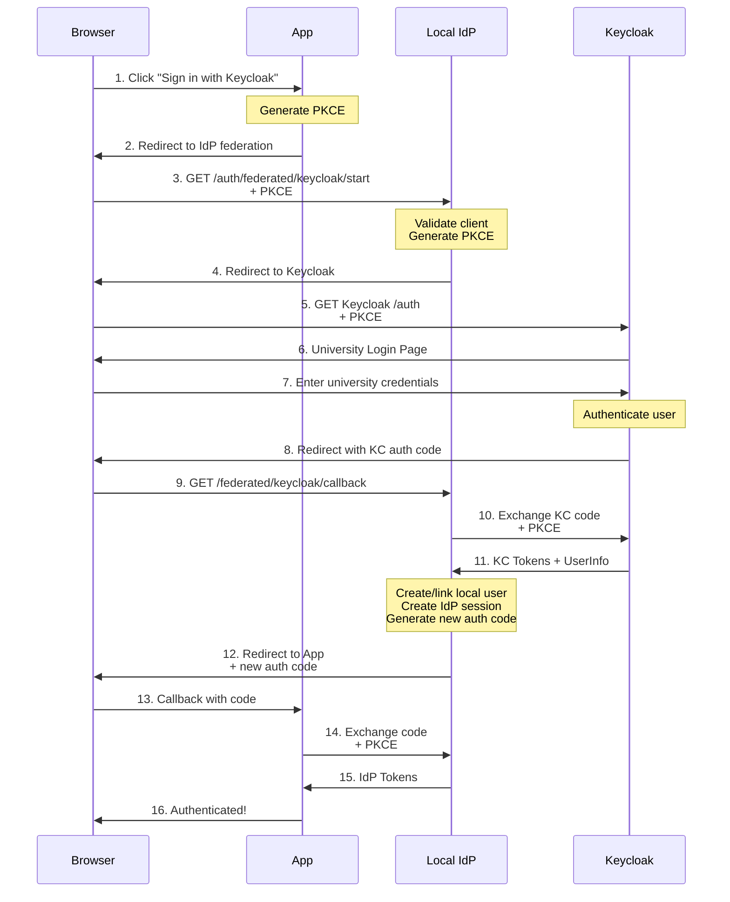
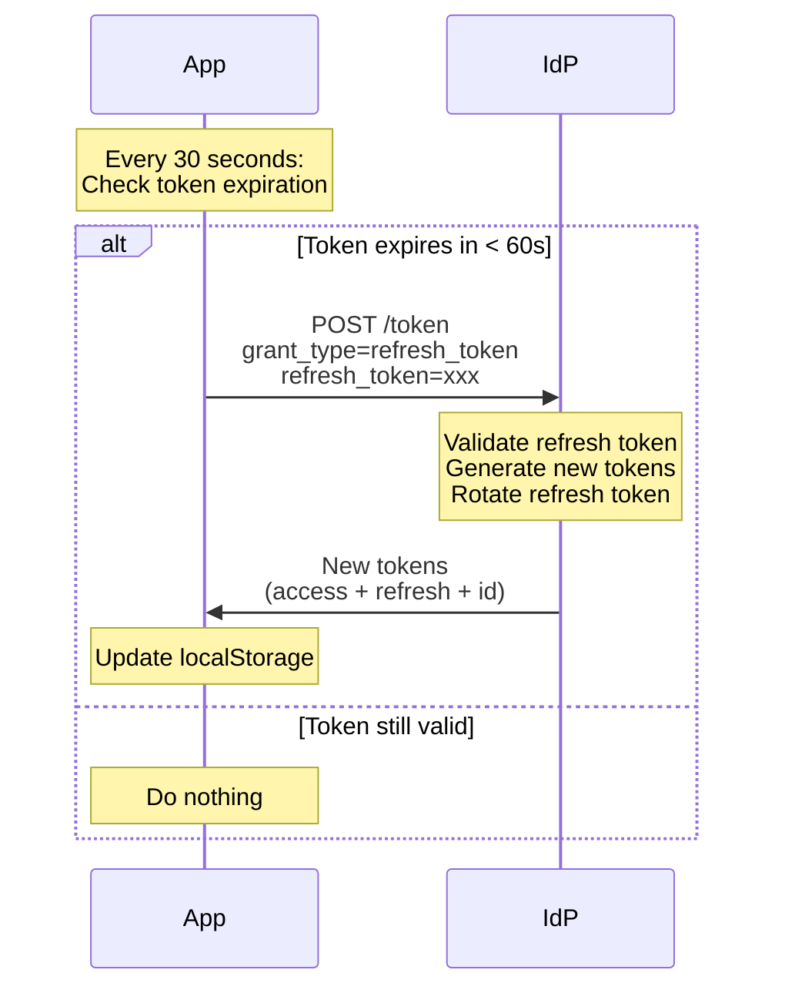
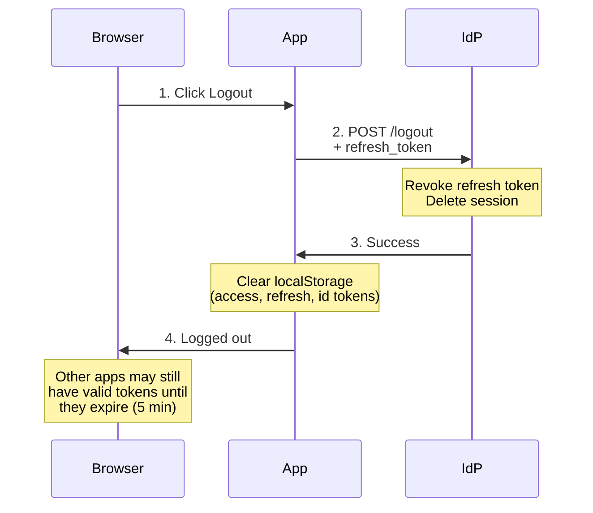
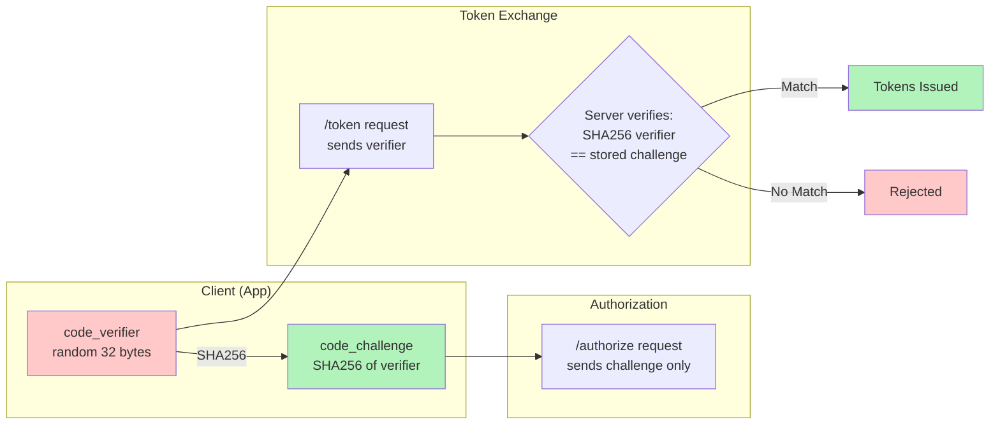
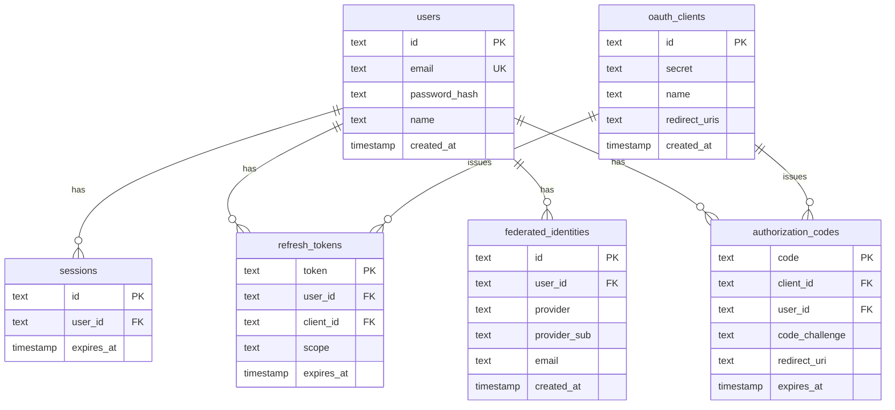

# SSO Διαγράμματα (Mermaid)

Τα παρακάτω διαγράμματα εμφανίζονται αυτόματα στο GitHub και VS Code.

---

## 1. Αρχιτεκτονική SSO

---

## 2. Πρώτη Σύνδεση (Local IdP)

---

## 3. SSO Auto-Login (App B μετά από App A)

---

## 4. Keycloak Federation Flow

---

## 5. Token Refresh Flow

---

## 6. Logout Flow

---

## 7. PKCE Flow Detail

---

## 8. Database Schema

