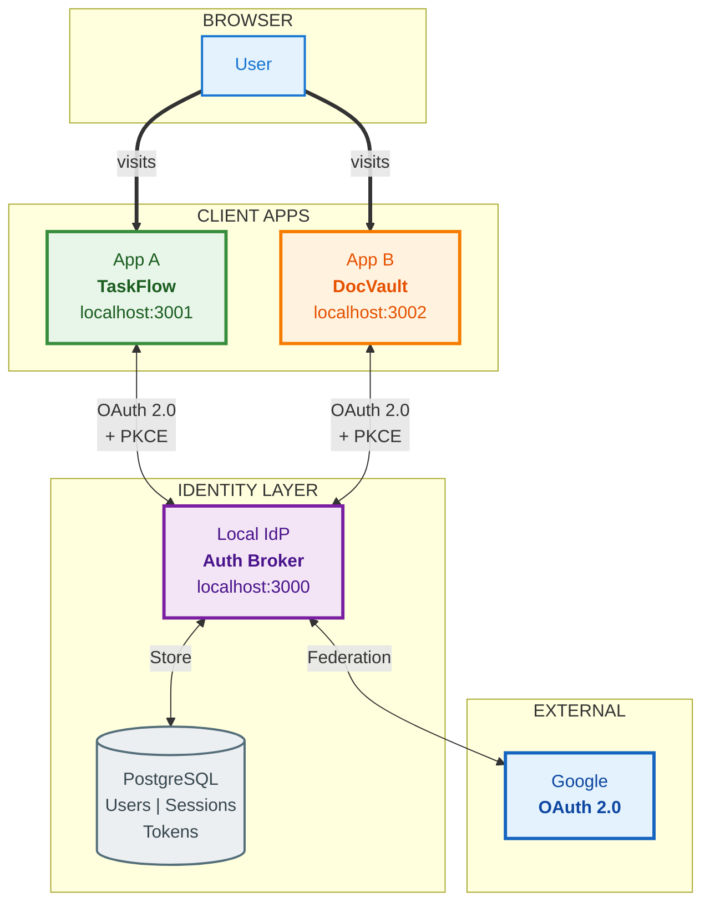
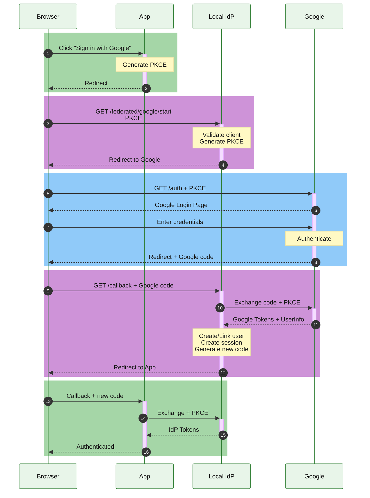
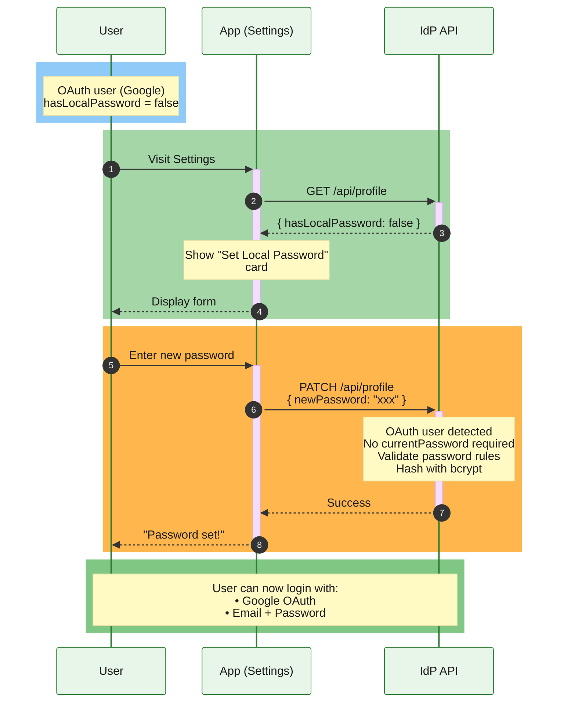
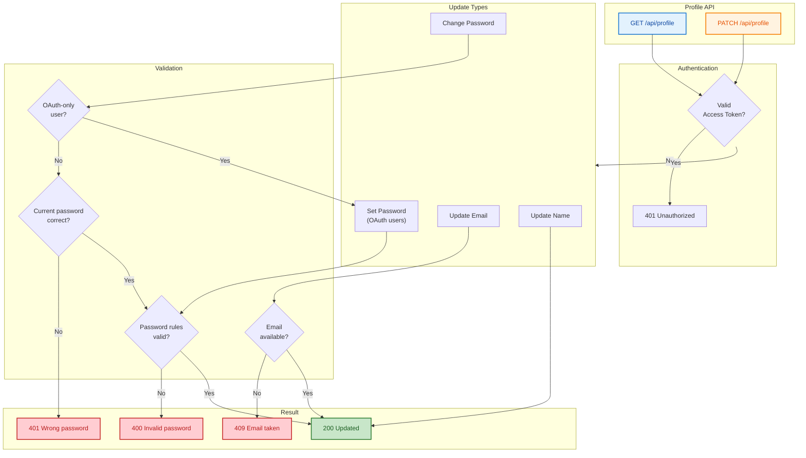

# SSO Διαγράμματα (Mermaid)

---

## 1. Αρχιτεκτονική SSO

---

## 2. Πρώτη Σύνδεση (Local IdP)

---

## 3. SSO Auto-Login (Το "Μαγικό" του SSO)

---

## 4. Google Federation (Double PKCE)

---

## 5. Token Lifecycle

---

## 6. PKCE Explained

---

## 7. Logout Flow

---

## 8. Database Schema

---

## 9. Security Overview

---

## 10. Account Linking (OAuth → Local Password)

---

## 11. Profile Management Flow

---

## 12. Complete SSO Flow Summary

